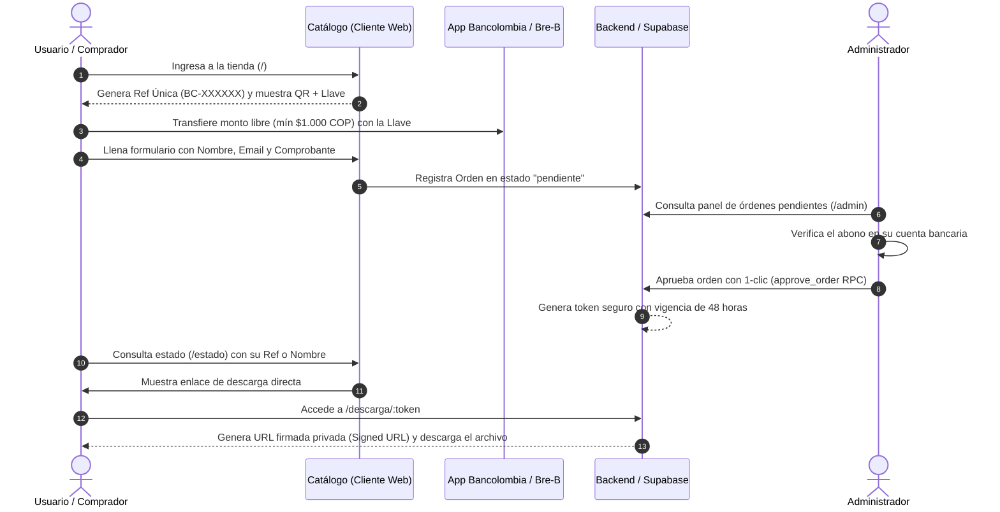
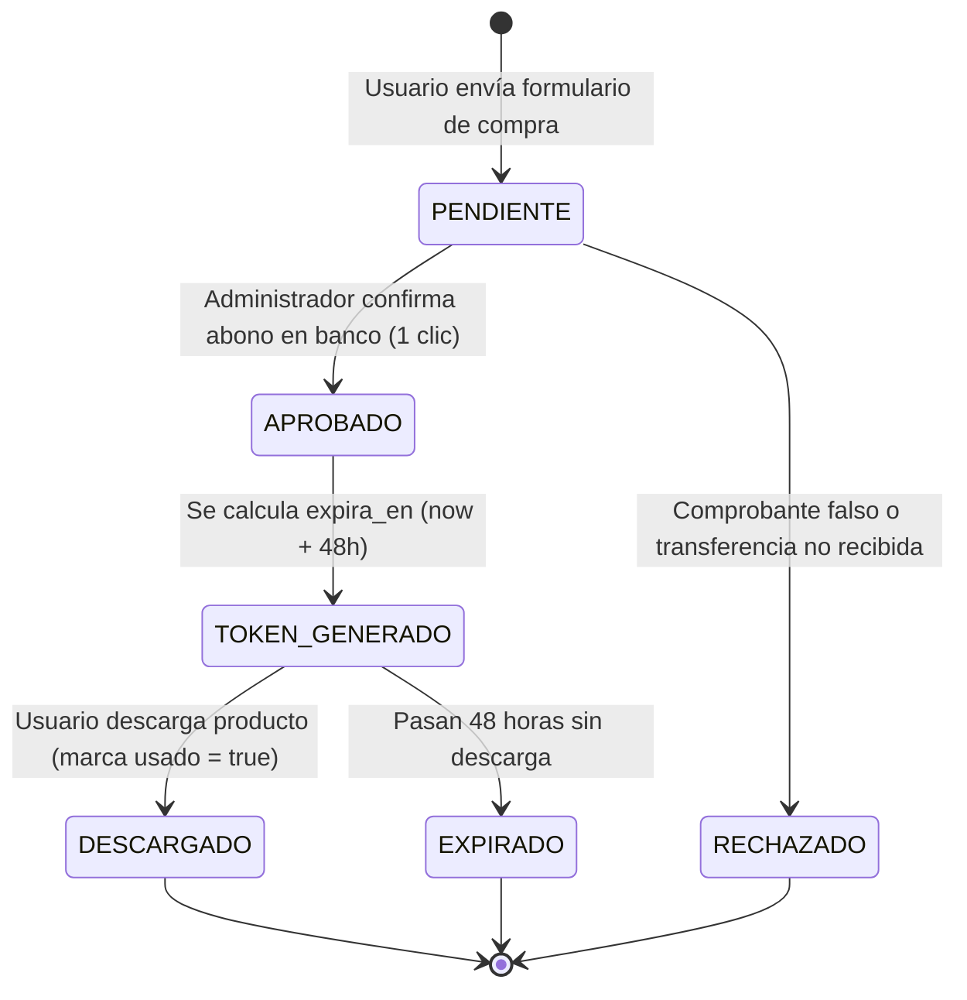

# 💎 Veltron Capital — Documentación Técnica y Arquitectura de Negocio

> **Tags de Obsidian:** #veltron #fintech #react19 #supabase #arquitectura #documentacion #mvp  
> **Estado Global del Repositorio:** `ACTUALIZADO`  
> **Última Auditoría de Código:** Septiembre 2026  
> **Versión del Core:** 1.2.0 (Mobile-First + Framer Motion Habilitado)

---

## 📑 Tabla de Contenidos

1. [[#1. Resumen Ejecutivo y Qué es Veltron Capital]]
2. [[#2. Modelo y Lógica de Negocio]]
3. [[#3. Arquitectura del Sistema]]
4. [[#4. Matriz de Estados y Ciclo de Vida de una Orden]]
5. [[#5. Esquema de Base de Datos y Seguridad (Supabase)]]
6. [[#6. Mapa Completo de Rutas y Páginas]]
7. [[#7. Inventario de Componentes y Estado Operativo]]
8. [[#8. Diagnóstico de Código: Actual, Provisional, Huérfano y Riesgos]]
9. [[#9. Guía de Puesta en Marcha y Configuración]]

---

## 1. Resumen Ejecutivo y Qué es Veltron Capital

### ¿Qué es?
**Veltron Capital** (`veltroncapital.com`) es una plataforma web de comercio digital enfocada en la distribución semanal de productos formativos y herramientas de productividad (libros digitales en PDF y plantillas financieras/operativas en Excel).

### ¿Qué hace?
Permite a cualquier usuario en Colombia adquirir y descargar herramientas digitales mediante transferencias bancarias de **comisión cero ($0 COP)** usando la infraestructura de **Llave Bancolombia Negocios** y el sistema interoperable **Bre-B**.

### Propuesta de Valor Central
- **Cero intermediarios costosos:** No cobra comisiones de pasarelas de pago tradicionales a través de Llave Bancolombia Negocios.
- **Monto Libre (Aporte Mínimo $1.000 COP):** Modelo accesible donde el usuario paga un valor simbólico o aporta lo que desee.
- **Descarga Segura y Efímera:** Los productos están protegidos en almacenamiento privado; los enlaces de descarga son tokens únicos con caducidad estricta de 48 horas y límite de uso.
- **Democracia de Contenidos:** La comunidad solicita y vota los próximos productos a lanzar.

---

## 2. Modelo y Lógica de Negocio

### Analogía Didáctica
> Imagina una **librería digital de confianza** con un mostrador físico:
> 1. Tomas una ficha con un código único en la entrada (`BC-XXXXXX`).
> 2. Escaneas el código QR del negocio con la aplicación de tu banco y realizas la transferencia de tu aporte.
> 3. Dejas tu comprobante y tus datos en la recepción.
> 4. El encargado verifica en segundos tu transferencia y te entrega una llave secreta que abre la caja fuerte de tu libro durante 48 horas.



---

## 3. Arquitectura del Sistema

### Stack Tecnológico Real
- **Frontend Framework:** `React 19.2.6` montado con `Vite 8.0.12`.
- **Enrutamiento:** `React Router DOM v7.18.0`.
- **Estilos y Maquetación:** `Tailwind CSS v4.3.1` (integración nativa con `@tailwindcss/vite`, CSS layer utilities y diseño Mobile-First).
- **Animaciones y Microinteracciones:** `Framer Motion v12.40.0` (con hook `useReducedMotion` y directiva CSS `prefers-reduced-motion` para accesibilidad).
- **Iconografía:** `Lucide React v1.21.0`.
- **Capa de Datos:** `Supabase JS v2.108.2` (Postgres 15+, RLS, Storage Buckets, RPC Functions).
- **Modo Dual (Resiliencia Offline/Local):** Motor híbrido en `src/services/api.js`. Si las credenciales de Supabase no están en el `.env`, conmuta automáticamente a almacenamiento simulado en `localStorage` mediante `src/services/mockData.js`.

---

## 4. Matriz de Estados y Ciclo de Vida de una Orden



### Detalle de Estados:
| Estado | Responsable | Acción en el Sistema |
| :--- | :--- | :--- |
| `[ACTUAL] pendiente` | Cliente / Usuario | Orden registrada con referencia única `BC-XXXXXX` y comprobante adjunto. |
| `[ACTUAL] aprobado` | Administrador | Se invoca la función RPC de Postgres `approve_order`. Genera token criptográfico de 24 bytes hex. |
| `[ACTUAL] rechazado` | Administrador | La orden se marca como inválida. Se muestra advertencia al consultar en `/estado`. |
| `[ACTUAL] usado` | Sistema de Descargas | El token fue redimido. Impide reenvío de enlaces o descargas recurrentes no autorizadas. |

---

## 5. Esquema de Base de Datos y Seguridad (Supabase)

### 1. Tablas en Producción (`supabase/migrations/20260903_mvp_biblioteca.sql`)

#### `products` (Catálogo)
- `id` (uuid, PK)
- `tipo` (text: `'libro'` | `'excel'`)
- `titulo` (text)
- `descripcion` (text)
- `precio` (integer, default `1000`)
- `archivo_path` (text, ruta en bucket `digital-products`)
- `imagen_preview` (text)
- `activo` (boolean, default `true`)
- `semana_inicio` (date), `semana_fin` (date)
- `created_at` (timestamptz)

#### `orders` (Órdenes de Compra)
- `id` (uuid, PK)
- `product_id` (uuid, FK `products.id`)
- `nombre_comprador` (text, nombre del pagador)
- `email_comprador` (text)
- `telefono_comprador` (text, opcional)
- `referencia_pago` (text, ej. `BC-849201`)
- `captura_url` (text, URL pública en bucket `payment-receipts`)
- `estado` (text: `'pendiente'` | `'aprobado'` | `'rechazado'`)
- `created_at` (timestamptz), `aprobado_at` (timestamptz)

#### `download_links` (Tokens de Entrega)
- `id` (uuid, PK)
- `order_id` (uuid, FK `orders.id`)
- `token` (text unique, encode 24 bytes hex)
- `expira_en` (timestamptz: `now() + 48 hours`)
- `usado` (boolean, default `false`)
- `created_at` (timestamptz)

#### `requests` & `request_votes` (Votación Comunitaria)
- Registro de solicitudes para futuros productos con conteo de votos.
- `request_votes` restringe votos duplicados mediante restricción `UNIQUE (request_id, identificador)`.

#### `admins` (Control de Acceso)
- `id` (uuid, FK `auth.users.id`)
- `nombre` (text)
- Valida permisos mediante función SQL `public.is_admin()`.

### 2. Buckets de Almacenamiento (Supabase Storage)
- **`digital-products` (PRIVADO):** Almacena los archivos maestros `.pdf` y `.xlsx`. Solo se accede mediante URLs firmadas generadas por `validateAndGetDownload(token)` con validez de 300 segundos.
- **`payment-receipts` (PÚBLICO):** Almacena las capturas de transferencias bancarias enviadas por los usuarios.

---

## 6. Mapa Completo de Rutas y Páginas

| Ruta | Componente | Función Principal | Estado |
| :--- | :--- | :--- | :--- |
| `/` | `CatalogPage.jsx` | Pantalla principal. Muestra el código QR interactivo, Llave Bancolombia, ficha de producto de la semana y modal de checkout para subir comprobante. | `[ACTUAL]` |
| `/comprar/:productId` | `CheckoutPage.jsx` | Flujo alternativo/secundario de compra dedicado a un producto específico con instrucciones detalladas de transferencia. | `[ACTUAL]` |
| `/estado` | `StatusPage.jsx` | Rastreador de orden. Búsqueda por Nombre del pagador, Email o Referencia (`BC-XXXXXX`). Si está aprobada, conduce a la descarga. | `[ACTUAL]` |
| `/descarga/:token` | `DownloadPage.jsx` | Validador de token seguro. Si el token está activo, no ha expirado y no fue usado, habilita la descarga directa y marca el token como consumido. | `[ACTUAL]` |
| `/solicitar` | `RequestPage.jsx` | Buzón y muro público de votación de productos solicitados por los clientes. | `[ACTUAL]` |
| `/admin` | `AdminPage.jsx` | Panel de control. Pestaña de verificación de pagos en 1-clic, publicación de nuevos productos al catálogo y gestión de solicitudes. | `[ACTUAL]` |

---

## 7. Inventario de Componentes y Estado Operativo

### Componentes Activos en el Flujo Principal:
1. **`Header.jsx`:** Barra de navegación superior con desenfoque de fondo (`glass-nav`), animación deslizante con Framer Motion, enlaces a `/`, `/estado`, `/admin`, menú móvil responsive accesible y selector de logo.
2. **`Footer.jsx`:** Pie de página corporativo con avisos legales y respaldo de red Bre-B / bancaria.
3. **`BrandLogo.jsx`:** Isotipo vectorial SVG personalizado (letra "V" en carbón `#2C2C2C` sobre arcos amarillo, naranja y azul marino) y logotipo tipográfico.
4. **`QRCodeSimulated.jsx`:** Módulo visual del QR oficial (`/qr_code_only.png`), botón de 1-tap para copiar la llave al portapapeles y botón con conversión en canvas HTML5 para descargar el QR en `.jpg` de alta calidad.
5. **`StatusBadge.jsx`:** Píldora visual para estados (`pendiente`, `aprobado`, `rechazado`).
6. **`CopyButton.jsx`:** Componente reutilizable para copiar valores con confirmación visual.

---

## 8. Diagnóstico de Código: Actual, Provisional, Huérfano y Riesgos

> [!WARNING]
> ### Auditoría Técnica de Puntos Críticos y Código Residual

| Elemento / Archivo | Clasificación | Diagnóstico y Acción Recomendada |
| :--- | :--- | :--- |
| `src/services/api.js` | `[ACTUAL]` | Núcleo del servicio. Soporta modo Supabase real y fallback a `localStorage`. Funciona correctamente. |
| `src/pages/AdminPage.jsx` | `[RIESGO]` | **Sin protección de rutas (Route Guard):** La URL `/admin` es accesible públicamente sin formulario previo de login en la UI. Aunque Supabase protege la DB mediante RLS, la interfaz debería estar resguardada por sesión de Supabase Auth. |
| `src/services/paymentService.js` | `[PROVISIONAL / HUÉRFANO]` | Contiene lógica de integración sandbox para **Bancolombia Button Payment**, OAuth 2.0 y simulación de Wompi/Cripto. **No está conectado** al flujo actual del carrito ni al catálogo. |
| `CalculatorIsland.jsx`, `CalculatorPanel.jsx`, `PaymentIsland.jsx`, `PaymentPanel.jsx`, `StakingPanel.jsx`, `StatusPanel.jsx`, `SuccessIsland.jsx` | `[HUÉRFANO / OBSOLETO]` | Componentes pertenecientes a un prototipo previo de cotización de tokens y criptoactivos ("Veltron Tokens / Staking"). No se importan en ninguna ruta de `App.jsx`. Se recomienda su archivado o remoción para reducir peso. |
| `src/cielodigital/` | `[HUÉRFANO / INTRUSO]` | Contiene un proyecto paralelo ("Cielo Digital" - mapa celeste astronómico). No tiene relación comercial ni funcional con Veltron Capital. Debe segregarse a otro repositorio. |
| `src/App.css` | `[OBSOLETO]` | Archivo residual de la plantilla por defecto de Vite. No es importado en `App.jsx` ni en `main.jsx`. |
| `approve_order` fallback | `[POR VALIDAR]` | En `api.js`, si el procedimiento almacenado RPC falla, intenta actualizar `orders` e insertar en `download_links` directamente. Bajo políticas RLS estrictas esto fallará a menos que el usuario esté autenticado con rol administrativo. |

---

## 9. Guía de Puesta en Marcha y Configuración

### 1. Variables de Entorno (`.env`)
```env
VITE_SUPABASE_URL=https://tu-proyecto.supabase.co
VITE_SUPABASE_ANON_KEY=tu-anon-key-de-supabase
VITE_BANCOLOMBIA_LLAVE=@veltroncapital
```
*(Si no se especifican variables de Supabase, la app corre de forma 100% autónoma en modo demo utilizando `localStorage`)*.

### 2. Comandos Operativos
```bash
# Instalación de dependencias
npm install

# Servidor de desarrollo local
npm run dev

# Compilación para producción
npm run build

# Previsualización del bundle de producción
npm run preview
```
