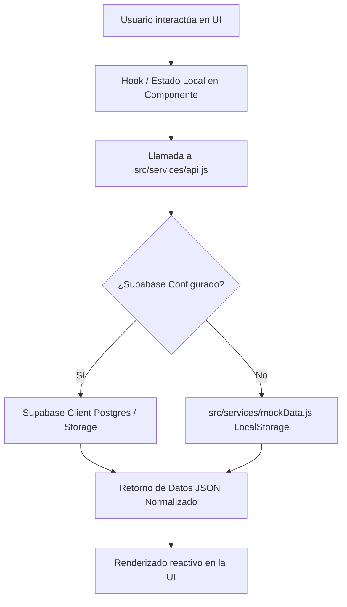

# 🔄 Flujo de Datos y Conexión de Servicios

## 1. Diagrama de Flujo de Información

## 2. Servicios Modulares Especializados
1. **`productsService.js`:**
   - `getActiveProducts()`: Trae únicamente los productos marcados con `activo = true`.
   - `getProductById(id)`: Consulta detallada por UUID.
   - `createProduct(data, fileBlob, previewBlob)`: Sube el archivo maestro a la carpeta privada `digital-products` y la previsualización a `payment-receipts`.
2. **`ordersService.js`:**
   - `generateShortRef()`: Genera la referencia `BC-XXXXXX` en el cliente antes de la transferencia.
   - `createOrder(orderData)`: Registra la orden en estado `pendiente`.
   - `searchOrders(query)`: Búsqueda flexible por referencia, correo o nombre del pagador.
   - `updateOrderStatus(id, estado)`: Si el estado es `aprobado`, dispara la función SQL RPC `approve_order`.
3. **`downloadsService.js`:**
   - `validateAndGetDownload(token)`: Verifica validez temporal (<48 horas), existencia y estado de uso.
   - `markTokenAsUsed(token)`: Inhabilita el token para prevenir reutilización.
4. **`requestsService.js`:**
   - `getRequests()`: Obtiene solicitudes ordenadas por votos descendentes.
   - `voteRequest(id, userIdentifier)`: Registra el voto evitando duplicidad en `request_votes`.
